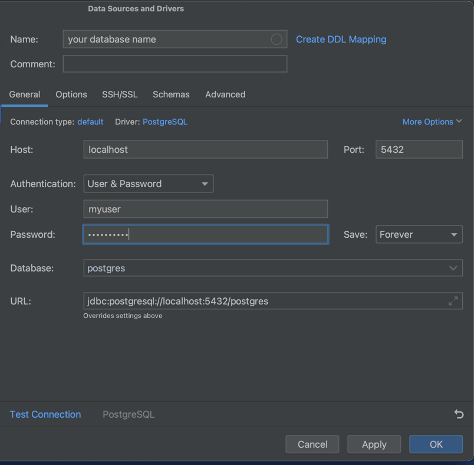

# Description

This is Northwind postgresql database encapsulated in docker image.

# Motivation

Learning SQL can be daunting. Especially when you need to setup whole database on your local machine, create tables etc.
and only then you can train Data Query Language (SELECTs etc.).
By using this docker image you can create learning-grade database prefilled with 14 tables, ready to play around and
boost your SQL skill right from your favourite IDE.


# How to use

## Prerequisites
[Docker Desktop](https://www.docker.com/products/docker-desktop/) is installed on your machine. 


## Instruction
You can start database by running this command:

```
docker run -d -p 5432:5432 --name postgres-database lukaszdutka/postgresql-sql-training
```

However, if you modified `init.sql`, you should first build the image: 
```
docker build -t <TAG> .
```
where **\<TAG\>** is usually `<username>/<projectname>`  
i.e. 
```
docker build -t lukaszdutka/postgresql-sql-training .
```
and just then run it with:

```
docker run -d -p 5432:5432 --name postgres-database <TAG>
```


After running this command you can connect to database (i.e. by configuring datasource in IntelliJ IDEA):


## Default credentials

```
POSTGRES_USER=myuser
POSTGRES_PASSWORD=mypassword
```
